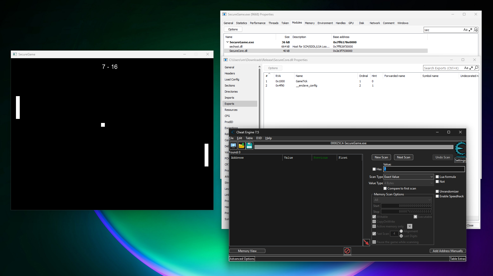
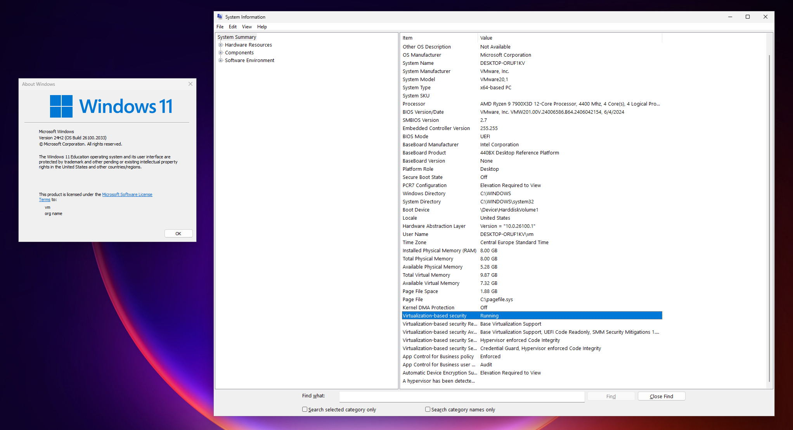

# SecureGame
This is a simple game inspired by the classic video game [Pong](https://en.wikipedia.org/wiki/Pong), but with a special twist - its game logic is implemented inside a [VBS enclave](https://learn.microsoft.com/en-us/windows/win32/trusted-execution/vbs-enclaves). 

Read the blog post to learn more:
- [Using VBS enclaves for anti-cheat purposes](http://tulach.cc/using-vbs-enclaves-for-anti-cheat-purposes/)



## Project
Project contains a single solution with two projects:
- `SecureGame` - The main process responsible for hosting the enclave, creating the window, querying player input and rendering using [SDL2](https://www.libsdl.org/)
- `SecureCore` - VBS enclave library (.DLL) implementing the core game functionality and storing the game runtime data

## Compiling
You will need:
- [Visual Studio 2022](https://visualstudio.microsoft.com/) version 17.9 or later
- [Windows Software Development Kit (SDK)](https://developer.microsoft.com/en-us/windows/downloads/windows-sdk/) version 10.0.22621.3233 or later
- [vcpkg](https://vcpkg.io/) installed and [configured to be used with MSBuild](https://learn.microsoft.com/en-us/vcpkg/users/buildsystems/msbuild-integration)

Then just open `SecureGame.sln` and compile both `SecureCore` and `SecureGame`.

## Testing
You will need:
- Windows 11 or later or Windows Server 2019 or later
- [VBS/HVCI](https://learn.microsoft.com/en-us/windows-hardware/drivers/bringup/device-guard-and-credential-guard) must be enabled
- [Test-signing must be enabled](https://learn.microsoft.com/en-us/windows-hardware/drivers/install/the-testsigning-boot-configuration-option)



The enclave library must be signed with a testing certificate. You can create and use a self-signed certificate:
```
New-SelfSignedCertificate -CertStoreLocation Cert:\\CurrentUser\\My -DnsName "MyTestEnclaveCert" -KeyUsage DigitalSignature -KeySpec Signature -KeyLength 2048 -KeyAlgorithm RSA -HashAlgorithm SHA256 -TextExtension "2.5.29.37={text}1.3.6.1.5.5.7.3.3,1.3.6.1.4.1.311.76.57.1.15,1.3.6.1.4.1.311.97.814040577.346743379.4783502.105532346"
```

And then use [SignTool](https://learn.microsoft.com/en-us/windows/win32/seccrypto/signtool) to sign the library:
```
signtool sign /ph /fd SHA256 /n "MyTestEnclaveCert" SecureCore.dll
```

Please note that you must create the certificate with the above command on your test machine (or test VM), or you'll need to export it and import it into the trusted certificate store on that machine.